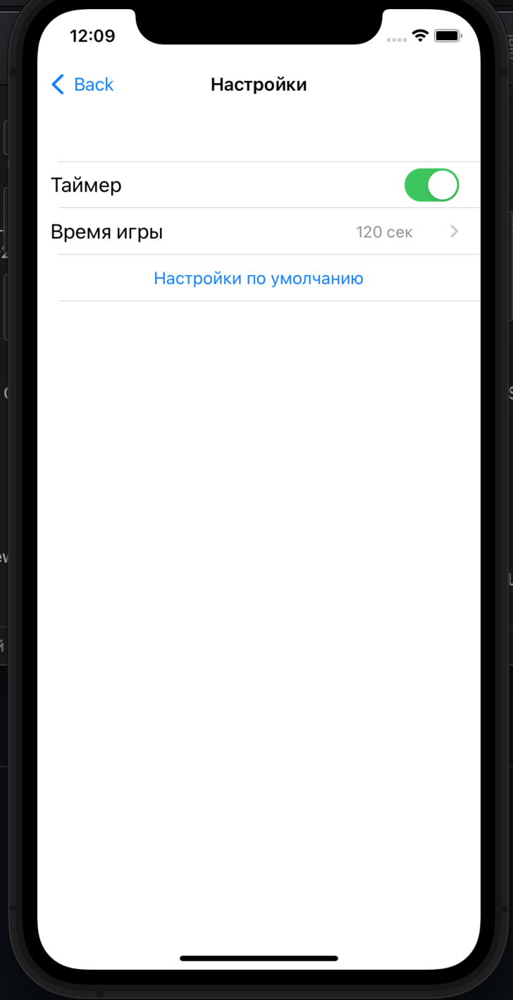

# FindNumber
<h4>Первый проект на Swift. Игра "Угадай число"</h4>

<!--    <h3>Главное меню</h4>-->
    
<!--    <h3>Рекорды</h4>-->
    
<!--    <h3>Настройки</h4>-->
    
<!--    <h3>Настройка времени игры</h4>-->
    
<!--    <h3>Начало игры</h4>-->
    
<!--    <h3>Игра</h4>-->
    
<!--    <h3>Результат игры</h4>-->
    

